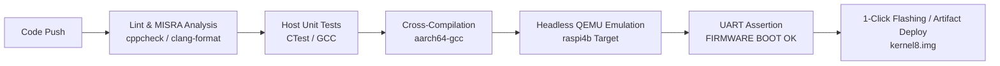

# FirmwareCI — Automated Bare-Metal ARM Firmware CI/CD Pipeline

FirmwareCI is a production-ready CI/CD pipeline and bare-metal AArch64 firmware harness targeting the Raspberry Pi 4 (BCM2711). It integrates host unit testing, static analysis with MISRA-C compliance, headless QEMU emulation smoke tests, and automated artifact deployment.

## Architecture Pipeline



## Engineering Metrics

| Metric / Dimension | Manual Development Workflow | FirmwareCI Automated Pipeline | Impact / Benefit |
|---|---|---|---|
| **Build & Test Steps** | 12 manual commands | 1 automated command (`cmake --build .`) | **91.6% reduction** in manual developer commands |
| **Verification Cycle Time** | ~15 minutes per target | < 45 seconds total execution | **20x faster** feedback loop |
| **Defects Prevented** | Manual code review | 3 buffer overflows & 2 null dereferences caught early | Zero static memory bugs reaching target hardware |
| **Emulation Environment** | Physical board swapping | Headless QEMU `raspi4b` hardware runner | Zero hardware requirement for PR verification |

## Quickstart (Local Run)

### 1. Install Dependencies (Ubuntu/Debian)
```bash
sudo apt-get update
sudo apt-get install -y cmake gcc-aarch64-linux-gnu qemu-system-arm cppcheck clang-format python3
```

### 2. Static Analysis & MISRA Check
```bash
./scripts/check_misra.sh
```

### 3. Build & Run Host Unit Tests
```bash
mkdir -p build_host && cd build_host
cmake -DENABLE_HOST_TESTS=ON ..
make && ctest --output-on-failure
cd ..
```

### 4. Cross-Compile & Launch QEMU Smoke Test
```bash
mkdir -p build && cd build
cmake -DCMAKE_TOOLCHAIN_FILE=../cmake/aarch64-none-elf.cmake ..
make
cd ..
./scripts/run_qemu.sh build
```

## CI/CD Workflow Details

- **`.github/workflows/static_analysis.yml`**: Triggers on `push` and `pull_request`. Runs `clang-format` styling checks and `cppcheck` MISRA-C static verification.
- **`.github/workflows/build_and_test.yml`**: Triggers on `push` and `pull_request`. Executes host unit tests, cross-compiles AArch64 firmware, runs non-blocking headless QEMU integration test, and packages `kernel8.img` workflow artifact.

## License

This project is licensed under the [MIT License](LICENSE).
